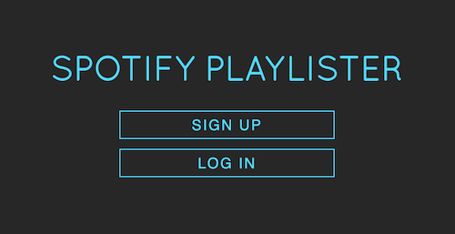
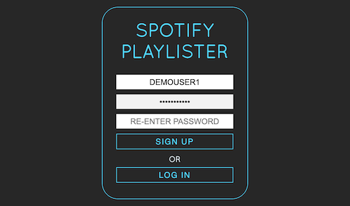
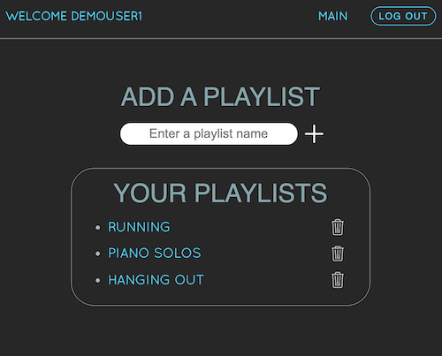
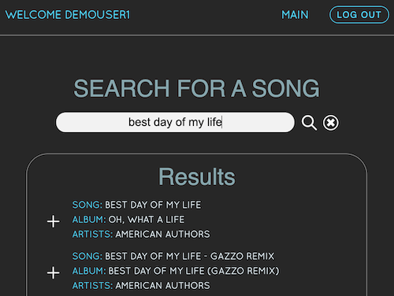

# Spotify Playlister

A simple app with a REST API that allows users to find songs using Spotify's Search API and then group them as in-app playlists. The frontend was built with JavaScript's React and Redux libraries. The backend runs on Ruby on Rails.

## Links

+ [Spotify Playlister](https://spotifyplaylisterapp.herokuapp.com/) - Play with the app! Note that this app works best on Chrome. Also, because this app is deployed on Heroku, it may take a minute to load. If it takes longer than this, you may need to refresh your browser.
+ [Demo](https://youtu.be/nvTEAAqh5Pg) - Watch a demo of the app.

## Features

+ Retrieve information about a song using Spotify's Search API
+ Create in-app playlists to organize songs
+ Securely sign up / log in

## Preview screenshots






## Configuration

1. Register a Spotify application and obtain a client ID and client secret. Follow this guide from Spotify for information on how to do this: https://developer.spotify.com/documentation/general/guides/app-settings.

2. Create a file titled '.env' in the spotify-playlister-frontend directory

3. In the '.env' file, include the following (replace the 'X's with your Spotify client ID and client secret from Step 1):

```
REACT_APP_CLIENT_ID=XXXXXXXXXXXXXXXXXXXXX
REACT_APP_CLIENT_SECRET= XXXXXXXXXXXXXXXX

```

4. While in the spotify-playlister-api directory, run 'bundle install' to install the necessary Ruby gems and 'rails s' to launch a server

5. Lastly, jump into the spotify-playlister-frontend directory and run 'npm start' to view the app in the development environment

## Contributing

Bug reports and pull requests are welcome on GitHub at https://github.com/alexander-mc/spotify-stats. This project is intended to be a safe, welcoming space for collaboration, and contributors are expected to adhere to the [Contributor Covenant](contributor-covenant.org) code of conduct.